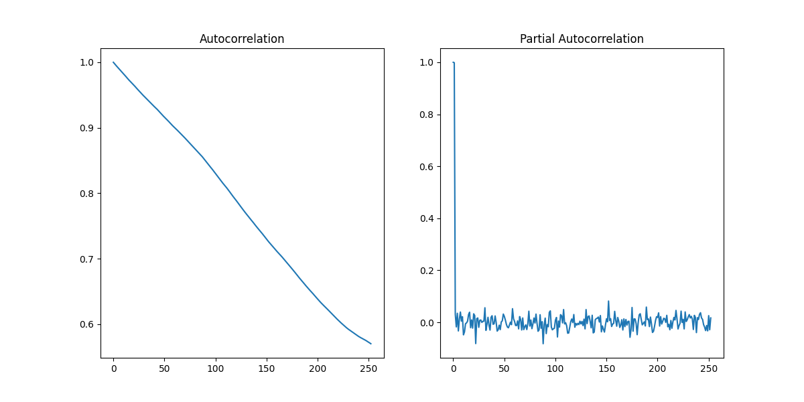
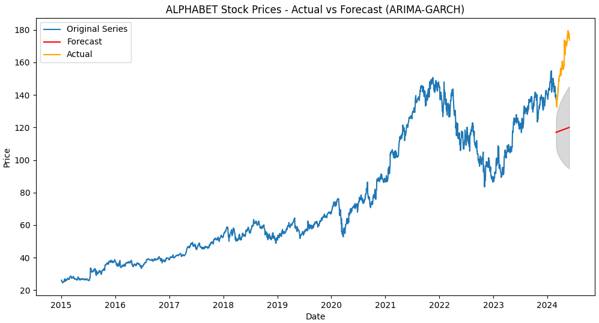
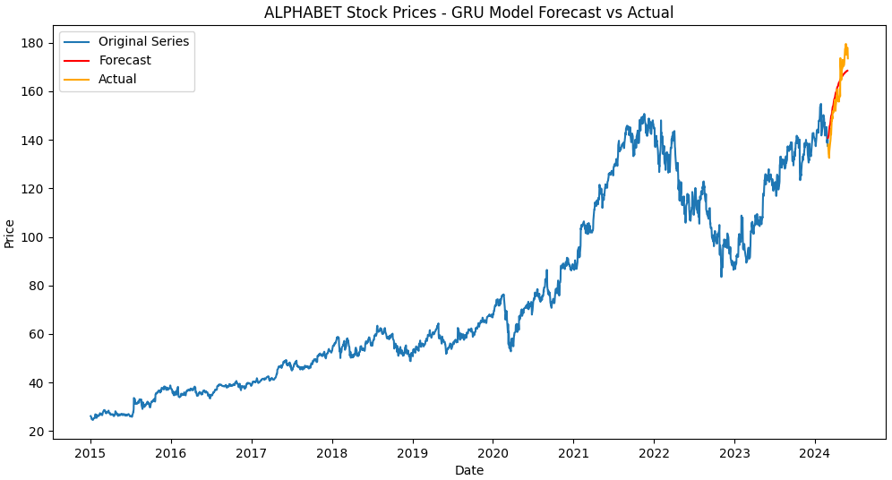

# Unveiling Trends in Leading AI and Machine Learning Companies' Stock Prices: A Time Series Analysis

## Overview
This project investigates the potential of time series analysis in predicting trends in the stock prices of three leading AI and Machine Learning companies: **Alphabet (Google)**, **Meta (Facebook)**, and **Microsoft**. The primary goal is to assess the effectiveness of various time series models in forecasting stock prices, providing valuable insights for both investors and companies.

The project involves using models such as **Exponential Smoothing**, **ARIMA**, **ARIMA-GARCH**, **Recurrent Neural Network (RNN)**, **Long Short-Term Memory (LSTM)**, and ** Gated Recurrent Unit (GRU)** to analyse long-term and seasonal trends and forecast future stock movements. **All analysis is conducted using Python, with some additional tasks performed in Excel.**

## Problem Statement
The research aims to:
- **Predict stock price trends**: Utilising time series models to uncover long-term and seasonal patterns in the stock prices of Alphabet, Meta, and Microsoft.
- **Compare model effectiveness**: Evaluate the performance of traditional statistical models versus machine learning models.
- **Provide actionable insights**: Generate accurate stock price forecasts to inform investment and corporate decision-making.

## Key Components

### 1. Data Preprocessing and Exploration
- **Approach**: Preprocessed stock price data from Yahoo Finance, handling missing values and outliers.
- **Tools Used**: ACF, PACF plots, stationarity tests (ADF, Ljung-Box).
- **Outcome**: Data was prepared for model training and trend analysis.

### 2. Time Series Models Applied
- **SMA & EMA**: Used as baseline models to capture basic stock price trends.
- **Exponential Smoothing**: Applied to model time series data with trend and seasonal components.
- **ARIMA & ARIMA-GARCH**: Representing statistical models, ARIMA captured trends, while ARIMA-GARCH also modelled volatility.
- **RNN, LSTM & GRU**: Deep learning models were employed to capture long-term dependencies and non-linear relationships.
- **Comparison**: The ARIMA-GARCH model emerged as the best performer among the statistical models, providing the most accurate forecasts for stock price volatility and trends based on RMSE and MAE scores. Among the deep learning models, GRU was nearly the best, with a marginally lower score for Meta compared to the RNN model, but the difference was negligible, leading to the selection of GRU for its efficiency and overall performance. Ultimately, the GRU model outperformed traditional models like ARIMA-GARCH, offering better predictive accuracy, particularly in capturing long-term dependencies and non-linear patterns in the data.

 

### 3. Model Evaluation
- **Evaluation Metrics**: RMSE, MAE, were used to evaluate model performance.
- **Results**: GRU had the lowest RMSE across all three companies, showing the highest predictive accuracy.
- **Insights**: Long-term upward trends were observed for all companies, with no significant seasonal patterns.

| **Models**     | **Alphabet** (RMSE, MAE) | **Meta** (RMSE, MAE)   | **Microsoft** (RMSE, MAE)  |
|----------------|--------------------------|------------------------|----------------------------|
| **ARIMA-GARCH**| (41.6175, 39.7798)        | (274.6141, 273.5990)    | (133.7888, 133.4012)        |
| **GRU**        | (5.9912, 5.2584)          | (22.3640, 18.0397)      | (10.7544, 9.1580)           |

## Data Sources
- Historical stock price data for Alphabet, Meta, and Microsoft was sourced from Yahoo Finance.
- The datasets contain daily closing prices, adjusted for dividends and stock splits.

## Ethical Considerations
- **Data Transparency**: Data sourced from Yahoo Finance ensures transparency.
- **Bias & Overfitting**: Care was taken to prevent model overfitting and to ensure that predictions were not biased by historical trends.

## Conclusion
The findings of this project suggest that deep learning models, particularly GRU, significantly outperform traditional time series models like ARIMA-GARCH when forecasting stock prices for AI and ML companies. These insights are valuable for investors and companies looking to make data-driven decisions in the rapidly evolving AI/ML landscape.

---

## Files in the Repository:
- **`time_series_analysis.py`**: The complete Python script that contains the full analysis, including data preprocessing, model training, evaluation, and forecasting.
- **`datasets/`**: The folder containing the raw stock price data for **Alphabet**, **Meta**, and **Microsoft**, sourced from Yahoo Finance.
- **`images/`**: Contains all output images, such as ACF/PACF plots and forecast comparisons.
- **`outputs/`**: This folder contains the following detailed analysis outputs:
  - **Outlier Detection Results**: Output files containing identified outliers in the stock price data.
  - **ADF (Augmented Dickey-Fuller) Test Results**: Files showing the stationarity test results for each stock.
  - **Predicted Stock Prices**: CSV files with the forecasted stock prices generated by the models.
  - **Model Performance Metrics**: Excel files containing the RMSE, MAE, and other evaluation metrics for each model.
  - **Detailed Analysis and Comparison**: Includes CSV and summary reports of the model comparisons, showing how each model performed across different companies.

Additionally, the repository contains a [complete report](AI_ML_Stock_Price_Forecasting.pdf) with methodology, results, and insights from the project analysis.

