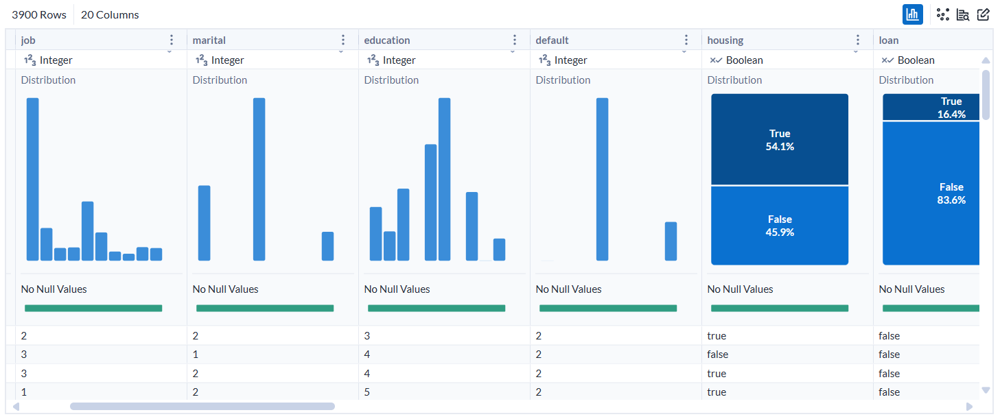
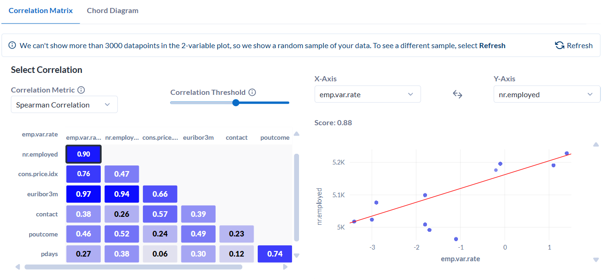
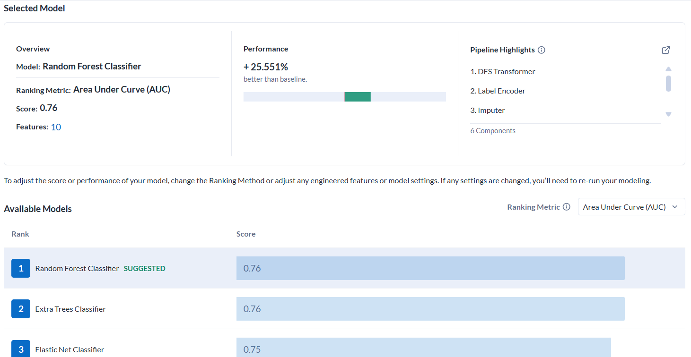

# Bank Marketing Machine Learning Project

## Overview
In this project, I developed a data-driven solution to help optimise a bank's marketing campaigns using machine learning techniques. The goal is to predict customer responses to marketing offers and ensure resources are directed towards the right audience.

This project was done using **Alteryx** and includes steps for data preparation, model training, evaluation, and application of insights to improve decision-making. The output is a **PowerPoint presentation** that summarises the findings and provides recommendations for enhancing campaign effectiveness.

## Problem Statement
The bank aims to:
- Boost campaign effectiveness by targeting potential subscribers.
- Optimise resource allocation for marketing efforts.
- Enhance customer acquisition while reducing churn.

## Key Components

### 1. Data Preprocessing
- **Approach**: Cleaned the data to handle missing values and encoded categorical variables.
- **Outcome**: Prepared a well-structured dataset for machine learning analysis.
  

### 2. Customer Response Prediction
- **Technique Used**: Trained machine learning models (Random Forest) to predict customer responses (subscribed or not).
- **Outcome**: The Random Forest model was the best performer with an AUC score of 0.76, showing significant improvement in customer classification.

### 3. Data-Driven Insights
- **Finding**: The model highlighted key economic indicators and previous interactions as strong predictors of customer response.
- **Outcome**: Insights helped identify customers more likely to subscribe, and those at risk of leaving the bank.

## Machine Learning Techniques
- **Supervised Learning**: Used to classify customers as likely subscribers or non-subscribers based on past behaviour and demographic data.
- **Unsupervised Learning**: Explored customer segmentation for targeted campaigns.

## Ethical and Legal Considerations
- **Data Privacy**: Ensured compliance with regulations like CCPA by maintaining data transparency and privacy.
- **Fairness and Bias**: Mitigated potential biases in training data to ensure fairness in customer targeting.
  
## Conclusion
This project provides a machine learning-based solution to enhance the bank's marketing campaign success by predicting customer responses and optimising resource allocation. The analysis offers valuable insights into customer behaviour that can drive data-informed decisions.

The complete project can be found in the presentation file [here](Bank_Marketing_Analysis.pdf).

---

## Files in the Repository:
- `Bank_Marketing_Analysis.pdf`: The complete presentation of the project.
- `bank_marketing_data.csv`: The original dataset used for analysis.
- `bank_marketing_data_encoded.csv`: The encoded dataset file.
- `bank_marketing_data_unseen.csv`: The unseen data used for prediction.
- `predicted_data.csv`: The predicted result.
