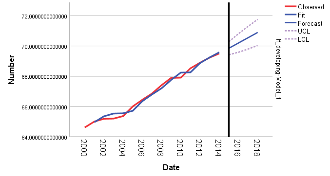
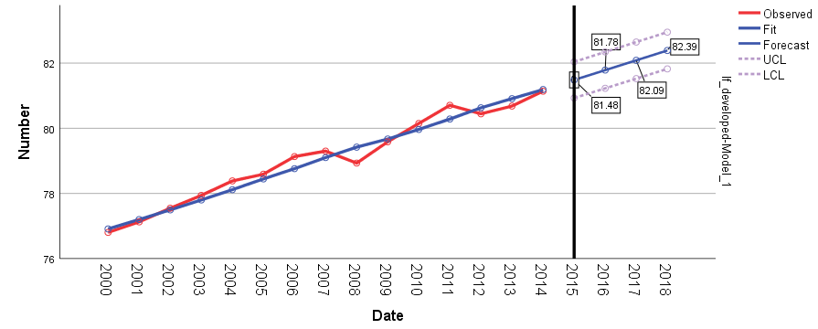

# Global Life Expectancy Statistical Analysis

## Overview
This project investigates the key elements influencing **life expectancy (LE)** across various countries using statistical analysis. The study is focused on analysing data from the **World Health Organization (WHO)** and explores how different factors such as **development status, Body Mass Index (BMI), healthcare expenditure, HIV prevalence, income composition of resources, and schooling** impact life expectancy. 

The analysis was conducted using **SPSS**, utilising statistical techniques such as **ANOVA, regression analysis, correlation analysis**, and **time series forecasting** to provide insights and predict future trends in global life expectancy.

## Main Report
The complete main report, including detailed analysis, findings, and recommendations, is available here: [Life Expectancy Analysis Report]( Life_Expectancy_Analysis_Report.pdf).

## Problem Statement
The aim of this analysis is to support the **World Health Organization (WHO)** by identifying the key factors influencing life expectancy, and to forecast future trends. The findings from this study can help guide future policies and interventions aimed at improving global health outcomes.

## Key Components

### 1. Data Overview and Preprocessing
- **Approach**: Data was sourced from the World Health Organization, covering multiple countries from 2000 to 2014. The dataset includes factors such as country development status, BMI, healthcare expenditure, HIV/AIDS prevalence, income composition, and schooling levels.
- **Outcome**: The data was prepared and cleaned for analysis, with relevant variables selected for statistical exploration.

### 2. Statistical Analysis
- **Descriptive Statistics**: Summary statistics were used to describe key characteristics such as BMI distribution, healthcare expenditure, and HIV prevalence across developed and developing countries.
- **ANOVA**: Analysis of variance was conducted to explore significant differences in life expectancy between **developed** and **developing** countries.
- **Regression Analysis**: Multiple regression was applied to assess the combined effect of several factors (BMI, healthcare expenditure, schooling, etc.) on life expectancy.
- **Correlation Analysis**: Relationships between life expectancy and each key factor were evaluated to understand the strength of these connections.

### 3. Time Series Forecasting
- **Forecasting Model**: Using SPSS’s Expert Modeler, time series forecasting (ARIMA and Holt’s model) was applied to predict life expectancy trends from 2015 to 2018 for both developing and developed countries.
- **Outcome**: The analysis predicted a steady rise in life expectancy for both developed and developing countries in the near future.

### 4. Key Findings
- **Developing vs Developed Countries**: A significant difference in life expectancy was found between developed and developing countries. Developed countries showed higher life expectancy rates, while developing countries experienced steady improvements over time.
- **Impact of Education and Income**: Higher levels of schooling and income composition were positively correlated with increased life expectancy, while **HIV/AIDS prevalence** showed a negative correlation.
- **Forecasting Results**: The ARIMA model predicted an increase in life expectancy for developing countries from **69.8 in 2015 to 70.9 in 2018**, while developed countries were forecasted to increase from **81.48 in 2015 to 82.39 in 2018**.

  **Developing Countries Forecasting:**

**Developed Countries Forecasting:**

## Data Sources
- The dataset was sourced from the **World Health Organization (WHO)** and covers data from 2000 to 2014 across multiple countries.

## Ethical Considerations
- **Data Privacy**: All data is aggregated and anonymised, with no personal information involved.
- **Responsible Use of Findings**: The findings should be used to inform policies and health interventions to promote improved life expectancy globally, especially in developing countries.

## Conclusion
This project illustrates how statistical analysis can be effectively used to explore factors influencing life expectancy globally. By employing statistical techniques such as ANOVA, regression analysis, and time series forecasting, valuable insights can be drawn to help inform health policies and improve life expectancy outcomes in different regions.

-----

## Files in the Repository:
- **`datasets/`**: The folder containing the datasets used in the analysis.
  - **`Life Expectancy Data_Original.xlsx`**: The original dataset file.
  - **`Life Expectancy Data_Cleaned.xlsx`**: The cleaned dataset file.
- **`analysis/`**: Contains life expectancy time series analysis files.
  - **`forecasting_developed_countries.spv`**: SPSS output file containing time series forecasting for developed countries.
  - **`forecasting_developing_countries.spv`**: SPSS output file containing time series forecasting for developing countries.
- **`images/`**: This folder contains graphs and visualisations of the analysis results.

